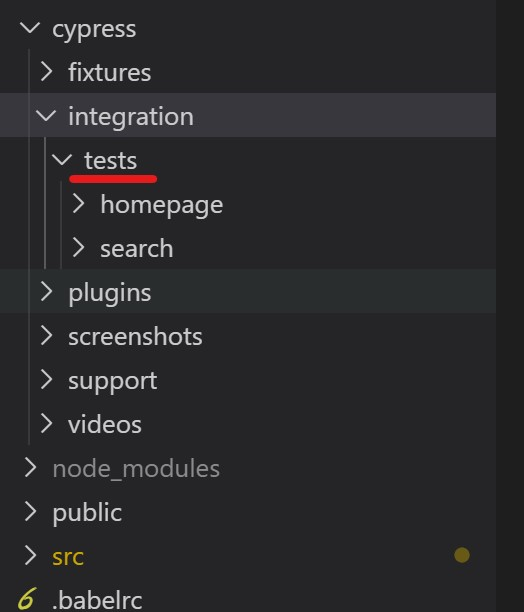
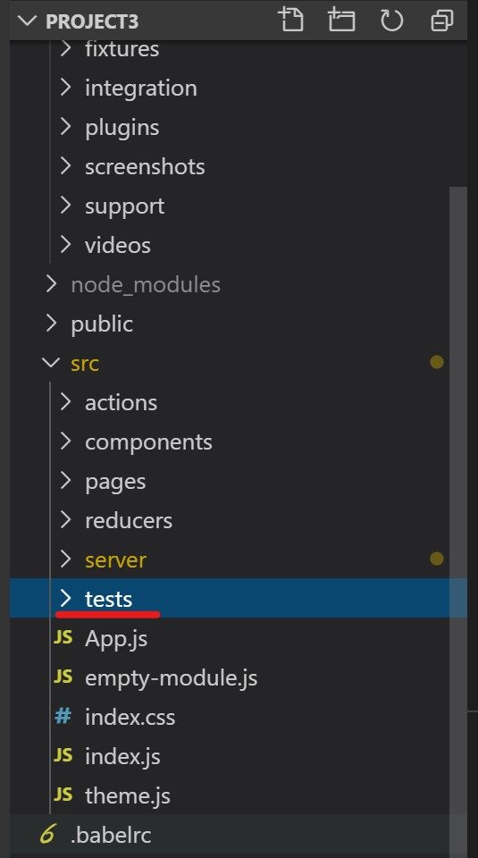

# IT2810 - Project 2 - Group 16
This is a project for the course Web Development (IT2810) at NTNU, fall 2019.

The project can be found [here](http://it2810-16.idi.ntnu.no/prosjekt3/)

## Contributors
*  [Kim André Midtlid](https://github.com/kamidtli)
*  [Eirik Sture](https://github.com/eirsture)
*  [Sebastian Aas](https://github.com/SebastianAas)

# Functionality

IMDbest is a website for finding movies. The website have a large database of movies from many directors and genres. On IMDbest you can search for movies based on title or director. 
You can also find movies based on genre. On the homepage, you have easy access to the search field and see the latest released movies. 
You can also make your own user and save your favorite movies.

## Front end

### React
In this project, we are using React as frontend with in combination with the of Redux as the 
state management. 

### Material UI
Material UI is React component library which have finished react components already made.
With already built components, it takes less time to build your website. 

We have used many of the components from Material UI, which have made it simpler to 
build the website, and saved us some time. It also has made the design more coherent with the
same design expression over the whole pages. 

### Redux

## Backend
###API

### MongoDB
We use MongoDB as the database for the project. MongoDB is a NoSQL database and uses JSON-like documents for storing the data. 
This gives flexibility and fields can vary from document to document and data structures can be changed over time. 
The document model maps to the objects in your application code, making data easy to work with.

For our database we uses the Sample Mflix Dataset which is a database given by MongoDB. 
The dataset contains details on movies. Each document contains a single movie, and information such as its title, release year, and cast. 

### Express js
Express is a minimal and flexible Node.js web application framework that provides a robust set of features for web and mobile applications.
Express.js is a frameworks which helps to manage everything, from routes, to handling requests and views. When using express, it is easier to 
connect to a backend and many of the network logistics features are implemented. 

We have choose to use Express js, because it makes a lot of the logistics easier. It makes it possible to connect to a database using 
MongoDB and Mongoose, which we also intended to use. 


### GraphQL
GraphQL is a query language for APIs and a can be used instead of REST API. GraphQL is different from REST API in the sense that it only gets
concrete data requirement you query instead of all the data. 

We have chosen to use GraphQL for our query language, since we were curious on how GraphQL worked and wanted to learn more.
Some of the groups members had a some experience with use of REST API, but we all agreed to use GraphQL, because we wanted to learn more.

Our logic for GraphQL is located in the server folder. In the server folder, there is a schema file, which contains the type definitions and resolvers. 
The type definitions is a JSON object which are describing all the types in the database, mutations, and the possible queries you can make. The queries
defined makes the foundation for which data you can ask for later from the frontend. The query definition tells you which arguments it takes as input and 
which data it gives out. But the query definition is not enough for graphql to receive the data from the database. You also need to match the 
query definitions with a resolver. There are a resolver for each query and it is the logistics for how to receive the data from the database. Here Mongoose
plays a big part. Mongoose is the middle man between the MongoDB database and GraphQL. To make Mongoose work, we also define specific models for 
Mongoose, which matches the type definitions in the GraphQL query definitions. 

#### Search
When you type the name of a movie or a director in the search field and press enter. The website 
executes a GraphQL query called filterMovies. The filterMovies query takes the search input and gets 
all the movies or movies from directors which fits with the input. The user is then redirected
to a new page, which shows the result. You can both search from the search field in the header
and from the search field on the homepage. 

#### Dynamic loading

#### Filtering and sorting


### Mongoose
For modeling your application data, Mongoose offers a simple, schema-based solution. 
It includes built-in casting, validation, query construction, hooks for business logic, and more, out of the box. 

To connect our database to the express server and node js, we uses mongoose. Mongoose is a elegant MongoDB object modeling for node.js, which makes it
easier for use to model the application data, and to connect to mongodb database. 


### Apollo Client
Apollo Client is a complete state management library for JavaScript apps. 
When using Apollo Client it makes it much simpler to write GraphQL queries.
After you have written a query , the Apollo Client will take care of requesting and caching your data, as well as updating your UI.

We have choose to use Apollo Client, because that makes it easier to connect the GraphQL query language with the frontend. 

We use Apollo as provider of data from the database. This can be done by giving a GraphQL query to a function from Apollo, which gives the data back 
in a JSON object. In that way, we can use the data from the query directly in the frontend.


### Testing
For testing we have chosen to use Cypress for end-to-end testing and Jest and Enzyme for unit testing.

#### Cypress
Cypress is a JavaScript framework for end-to-end testing, which makes it easier to test user interactions. Cypress have a graphical user interface which
makes it easy to see whats being tested. With Cypress you can simulate how a user will interact with the page, and check if all the components are 
working properly and that the redirect between pages are loading correct. Cypress can also test if the data are loading properly and that the backend are
working. 

The Cypress tests are situated in the Cypress folder in the root directory. 

To run the Cypress test write `npm run cypress:run`. 
To open the graphical interface of Cypress write `npm run cypress`

Note: The website has to be up and running for the test to run. That means that if you are trying to 
run the tests locally, you need to run both the node server and react application. 

This is how a one of our Cypress test look. This test checks if the search field are working properly
The test first checks if the search redirects to the right page, and the second test checks if the
content on the search page are correct.
```ecmascript 6
describe('Search field homepage test', function () {
     it(`Test the redirect of the search field`, function () {
         cy.visit('/')
         cy.get('#outlined-with-placeholder').type('Pirates {enter}')
         cy.url().should('eq', `http://localhost:3000/search/Pirates`)
     })
     it('Checks the content of the search page after search', function () {
         cy.get('.MuiGrid-container > :nth-child(1)').should('contain.text', "Pirates of the Caribbean: The Curse of the Black Pearl")
         cy.get('.MuiGrid-container > :nth-child(7)').should('contain.text', "Pirates of the Great Salt Lake")
         cy.get('.MuiGrid-container').children().should('have.length', 7)
     })
 });
 ```

#### Jest
Jest is also a JavaScript framework for testing, but can also be used for unit testing. Jest makes it easy to write snapshot-tests. Snapshot test makes 
it easy to check that no code have changed unintended. Enzyme is also test framework, which interacts with Jest, and making it easier to test. 

To run the test in Jest run the command `npm test`
The Jest tests are located in the tests folder in src. 


We are mostly using snapshots test for unit testing in this project. Here
is what one of the test look like. 
```ecmascript 6
describe('Card List', () => {
  it('renders without crashing', () => {
    const cardList = shallow(<MockedProvider mocks={mocks}><CardList /></MockedProvider>);
    expect(cardList.toJSON).toMatchSnapshot();
  });
});

```


## Installation


This project was bootstrapped with [Create React App](https://github.com/facebook/create-react-app).

## Available Scripts

In the project directory, you can run:

### `npm start`

Runs the app in the development mode.<br>
Open [http://localhost:3000](http://localhost:3000) to view it in the browser.

The page will reload if you make edits.<br>
You will also see any lint errors in the console.

### `npm test`

Launches the test runner in the interactive watch mode.<br>
See the section about [running tests](https://facebook.github.io/create-react-app/docs/running-tests) for more information.

### `npm run build`

Builds the app for production to the `build` folder.<br>
It correctly bundles React in production mode and optimizes the build for the best performance.

The build is minified and the filenames include the hashes.<br>
Your app is ready to be deployed!

See the section about [deployment](https://facebook.github.io/create-react-app/docs/deployment) for more information.

### `npm run eject`

**Note: this is a one-way operation. Once you `eject`, you can’t go back!**

If you aren’t satisfied with the build tool and configuration choices, you can `eject` at any time. This command will remove the single build dependency from your project.

Instead, it will copy all the configuration files and the transitive dependencies (Webpack, Babel, ESLint, etc) right into your project so you have full control over them. All of the commands except `eject` will still work, but they will point to the copied scripts so you can tweak them. At this point you’re on your own.

You don’t have to ever use `eject`. The curated feature set is suitable for small and middle deployments, and you shouldn’t feel obligated to use this feature. However we understand that this tool wouldn’t be useful if you couldn’t customize it when you are ready for it.

## Learn More

You can learn more in the [Create React App documentation](https://facebook.github.io/create-react-app/docs/getting-started).

To learn React, check out the [React documentation](https://reactjs.org/).

### Code Splitting

This section has moved here: https://facebook.github.io/create-react-app/docs/code-splitting

### Analyzing the Bundle Size

This section has moved here: https://facebook.github.io/create-react-app/docs/analyzing-the-bundle-size

### Making a Progressive Web App

This section has moved here: https://facebook.github.io/create-react-app/docs/making-a-progressive-web-app

### Advanced Configuration

This section has moved here: https://facebook.github.io/create-react-app/docs/advanced-configuration

### Deployment

This section has moved here: https://facebook.github.io/create-react-app/docs/deployment

### `npm run build` fails to minify

This section has moved here: https://facebook.github.io/create-react-app/docs/troubleshooting#npm-run-build-fails-to-minify
