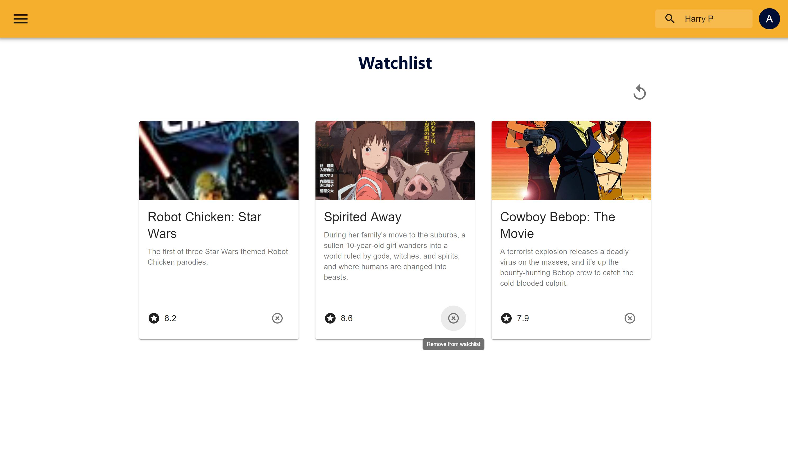

# IT2810 - Project 2 - Group 16

This is a project for the course Web Development (IT2810) at NTNU, fall 2019.

The project can be found [here](http://it2810-16.idi.ntnu.no/prosjekt3/)

## Contributors

- [Kim André Midtlid](https://github.com/kamidtli)
- [Eirik Sture](https://github.com/eirsture)
- [Sebastian Aas](https://github.com/SebastianAas)

## Installation

To set up this project and run this website, first clone the project using

`git clone https://gitlab.stud.idi.ntnu.no/IT2810-H19/teams/team-16/project2.git`

Then install all the necessary node modules using

`npm install`

Then you need to run the server, so the website can get the data from the backend.
Run the server using

`node server/server.js`

Finally you can run the website using

`npm start`

## Code style

We have chosen to follow the ESLint code style in this project to keep a consistent
code style. All members of the group uses a linter on the IDE, which fixes the linting
for us. We use the Airbnb eslint code style.

# Functionality

IMDbest is a website for finding movies. The website has a large database of movies from many different directors and genres. On IMDbest you can search for movies based on title or director. You can also find movies based on genre. On the homepage, you have easy access to the search field and see the latest released movies. You can also make your own user and save the movies you might want watch in the future.

## Front end

Homepage


Searchpage


Watchlist


### Advanced visualization
For each movie we generate a graph showing the movie's IMDb rating against all other movies from the same year.


### React

In this project, we are using React as frontend in combination with Redux as the
state management tool.

### [Material UI](https://material-ui.com/)

Material UI is a React component library which have finished react components already made. With already built components, it takes less time to build our website.

We have used many of the components from Material UI, which has made it simpler to build the website, and saved us some time. It also has made the design more coherent with the same design expression over all the pages.

### Redux
We chose to use Redux as a state management library because of Redux's popularity and well documented APIs. The redux store is used to keep information about the client's state and is stored locally at the client. The information we store is

* Filter data such as sorting values, active genre, preferred rating and year range.
* User data such as username and corresponding watchlist (which is cross-validated with the database content).
* Recent searches.
* Visited pages, to allow for dynamic loading of new data.
* ID of the last movie visited.

By storing this information in the redux store we can keep the filter values consistent, even though the user updates the search query, or moves between detailed movie views and list views, and the user information allows for a fast and consistent rendering of the user's watchlist.

## Backend

### API

### MongoDB

We use MongoDB as the database for the project. MongoDB is a NoSQL database and uses JSON-like documents for storing the data.
This gives flexibility and fields can vary from document to document and data structures can be changed over time.
The document model maps to the objects in your application code, making data easy to work with. We chose to use MongoDB over a different database, because it is a very popular database to use for web developement in stacks such as [MERN](https://scotch.io/@deityhub/getting-started-with-the-mern-stack) and [MEAN](http://meanjs.org/).

For our database we uses the [Sample Mflix Dataset](https://docs.atlas.mongodb.com/sample-data/sample-mflix/) which is a database given by MongoDB.
The dataset contains details on over 23 000 movies, between 1893 and 2016. Each document contains a single movie and information such as its title, release year, imdb rating and cast. There are som duplicate movies, but this is a problem that comes from the original dataset from MongoDB.

Our database also has the possibility to save users that are made on the website. To make it simple you do not need a password to create or log into a user. As a user you can save movies to a watchlist in the database.

### Express js

Express is a minimal and flexible Node.js web application framework that provides a robust set of features for web and mobile applications.
Express.js is a frameworks which helps to manage everything, from routes, to handling requests and views. When using express, it is easier to
connect to a backend and many of the network logistics features are implemented.

We have choose to use Express js, because it makes a lot of the logistics easier. It makes it possible to connect to a database using
MongoDB and Mongoose, which we also intended to use.

### GraphQL

GraphQL is a query language for APIs and a can be used instead of REST API. GraphQL is different from REST API in the sense that it only gets
concrete data requirement you query instead of all the data.

We have chosen to use GraphQL for our query language, since we were curious on how GraphQL worked and wanted to learn more.
Some of the groups members had a some experience with use of REST API, but we all agreed to use GraphQL, because we wanted to learn more.

Our logic for GraphQL is located in the server folder. In the server folder, there is a schema file, which contains the type definitions and resolvers.
The type definitions is a JSON object which are describing all the types in the database, mutations, and the possible queries you can make. The queries
defined makes the foundation for which data you can ask for later from the frontend. The query definition tells you which arguments it takes as input and
which data it gives out. But the query definition is not enough for graphql to receive the data from the database. You also need to match the
query definitions with a resolver. There is a resolver for each query and it is the logic for how to receive the data from the database. Here Mongoose
plays a big part. Mongoose is the middle man between the MongoDB database and GraphQL. To make Mongoose work we also define specific models, which matches the type definitions in the GraphQL query definitions.

#### Search
When you type the name of a movie or a director in the search field and press enter, the website executes a GraphQL query called filterMovies. The filterMovies query takes the search input and gets all the movies or movies from directors which fits with the input. The user is then redirected to a new page, which shows the result. You can both search from the search field in the navbar and from the search field on the homepage. 

#### Dynamic loading
When a user scrolls to the bottom a search result page, a query is sent to the backend to request additional data. The response data is rendered at the bottom of the page and the amount of pages visited is increased in the Redux store to ensure consistency. Every time a query for new data is sent, the amout of data currently rendered is passed as an argument to make sure we don't query and show overlapping data. By implementing dynamic loading we reduce the amount of bandwidth needed, and minimize the overall load on the user. In addition to this the request for data executes in a fraction of the time it takes to request all relevant data.

#### Filtering and sorting
The filtering and sorting on the web page is done by the graphql query. The GraphQL query takes in both search value, genre, year range, and rating range, which are used to filter out the wrong data from the dataset. 

The sorting is done by a built-in function from Mongoose, which sorts either alphabetically, by rating or by release date. 

### Mongoose

For modeling your application data, Mongoose offers a simple, schema-based solution.
It includes built-in casting, validation, query construction, hooks for business logic, and more, out of the box.

To connect our database to the express server and node js, we uses mongoose. Mongoose is a elegant MongoDB object modeling for node.js, which makes it easier for use to model the application data, and to connect to mongodb database.

### Apollo Client

Apollo Client is a complete state management library for JavaScript apps.
When using Apollo Client it makes it much simpler to write GraphQL queries.
After you have written a query , the Apollo Client will take care of requesting and caching your data, as well as updating your UI.

We have choosen to use Apollo Client, because it makes it easier to connect the GraphQL query language with the frontend.

We use Apollo as provider of data from the database. This can be done by giving a GraphQL query to a function from Apollo, which returns the data back in a JSON object. In that way, we can use the data from the query directly in the frontend.

### Testing

For testing we have chosen to use Cypress for end-to-end testing and Jest and Enzyme for unit testing.

#### Cypress

To run the Cypress test write `npm run cypress:run`.
Cypress is a JavaScript framework for end-to-end testing, which makes it easier to test user interactions. Cypress have a graphical user interface which makes it easy to see whats being tested. With Cypress you can simulate how a user will interact with the page, and check if all the components are working properly and that the redirect between pages are loading correct. Cypress can also test if the data is loading properly and that the backend is
working.

All cypress test are working properly


To run the Cypress test write `npm run cypress:run`.
To open the graphical interface of Cypress write `npm run cypress`

Note: The website has to be up and running for the test to run. That means that if you are trying to run the tests locally, you need to run both the node server and react application.

This is how a one of our Cypress test look. This test checks if the search field are working properly
The test first checks if the search redirects to the right page, and the second test checks if the
content on the search page are correct.

```ecmascript 6
describe('Search field homepage test', function () {
     it(`Test the redirect of the search field`, function () {
         cy.visit('/')
         cy.get('#outlined-with-placeholder').type('Pirates {enter}')
         cy.url().should('eq', `http://localhost:3000/search/Pirates`)
     })
     it('Checks the content of the search page after search', function () {
         cy.get('.MuiGrid-container > :nth-child(1)').should('contain.text', "Pirates of the Caribbean: The Curse of the Black Pearl")
         cy.get('.MuiGrid-container > :nth-child(7)').should('contain.text', "Pirates of the Great Salt Lake")
         cy.get('.MuiGrid-container').children().should('have.length', 7)
     })
 });
```

#### Jest

Jest is also a JavaScript framework for testing, but can also be used for unit testing. Jest makes it easy to write snapshot-tests. Snapshot test makes
it easy to check that no code have changed unintended. Enzyme is also test framework, which interacts with Jest, and making it easier to test.

To run the test in Jest run the command `npm test`

Here is what one of the snapshottests look like.

```React JSX
describe('Card List', () => {
  it('renders without crashing', () => {
    const cardList = shallow(<MockedProvider mocks={mocks}><CardList /></MockedProvider>);
    expect(cardList.toJSON).toMatchSnapshot();
  });
});

```

The redux store is tested by unit tests. Below is an example of a unit test.

```React JSX
describe('Reducer', () => {
  it('should login a user', () => {
    const state = { username: null };
    const newState = reducer(state, {
      type: 'LOGIN_USER',
      username: 'loginPerson'
    });
    expect(newState.user).toMatch('loginPerson');
  });
});

```